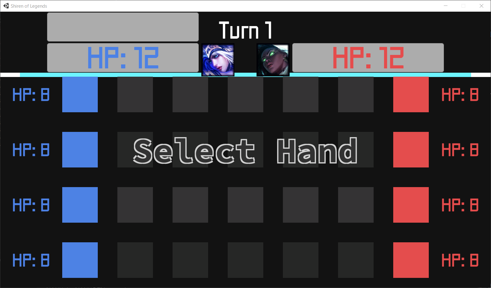
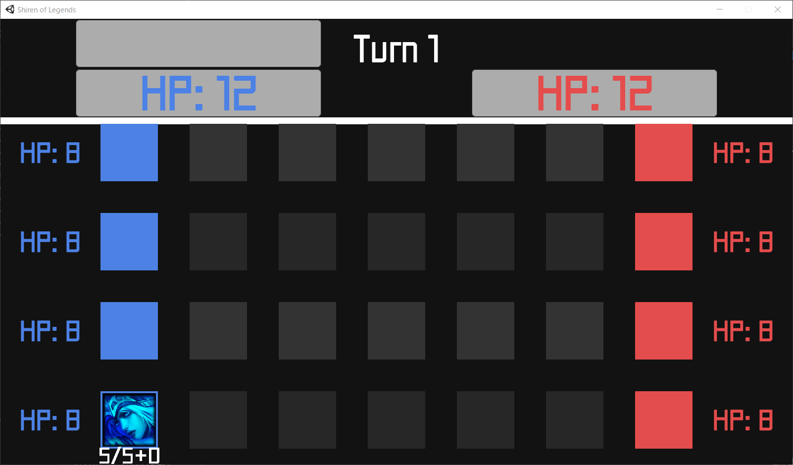
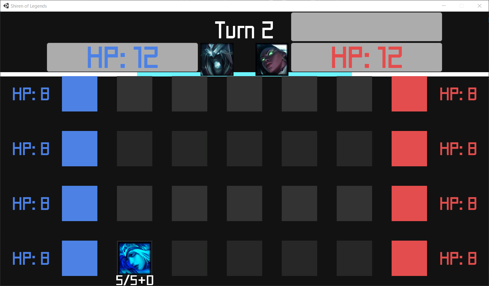
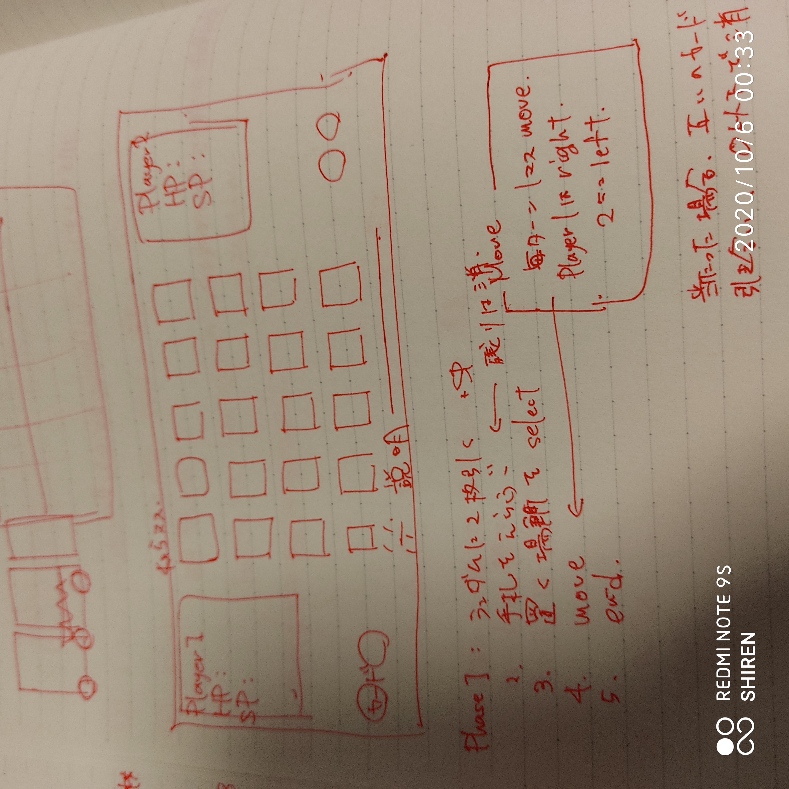

# [indie game] Shiren of Legends
暇だったからゲームを作ってみた。

2人対戦型ボードゲーム * タワーディフェンス

遊戯王 * League of Legends

 

# ルール
1. 配られた2枚のカードから1枚を選択

2. カードを召喚する"レーン"を選択

3. 自分のカードが1マス進む

4. 相手カードと重なったら戦闘(Shadowverse方式)
5. 相手マスにたどり着いたら、タワーにダメージ
6. タワー破壊済みの相手マスにたどり着いたら、プレイヤーに直接ダメージ
7. 相手ライフを0にしたら勝利

 

# カード効果
1. Anivia: HP 5 / AD 5

    このカードが破壊された場合、同じレーンのスタート地点にMaxHPで蘇生する。

2. Ashe: HP 5 / AD 5

    このカードが召喚に成功した場合、同じレーンのすべての相手モンスターに1ダメージを与え、スタン(次のターン移動不可)を付与する。

3. Shyvana: HP 3 / AD 3

    このカードが召喚に成功した場合、HP/ADがそれぞれドラゴンバフの数だけ上昇する。

4. Karthus: HP 5 / AD 5

    このカードが破壊された場合、すべての相手モンスターにAD*2のダメージを与える。

5. Sena: HP 4 / AD 2

    このカードが召喚に成功した場合、同じレーンのすべての相手モンスターに1ダメージを与え、すべての自分モンスターは1回復する。

6. Soraka: HP 3 / AD 2

    このカードが召喚に成功した場合、すべての自分モンスターを2回復する。

7. Vladimir: HP 6 / AD 10

    ①1ターンに1度、2の自傷ダメージを受ける。②攻撃成功時、その攻撃力分のHPを回復し、ADを2上昇する。

8. Yasuo: HP 10 / AD 10

    ①1ターンに1度、2シールドを獲得する。②このカードはスキルショットの効果を受けない。

 

# ドラゴン
5ターン毎にドラゴンが出現する。討伐するとドラゴンバフを獲得できる。

# 操作方法等

WASD: 選択

E: 決定

T: 相手の操作方法を切り替える

デッキを作らずにゲーム開始した場合は、各1枚のテンプレートが使用される。

 

# 感想
LoLの知識を持った今だから完成したデザイン。

テストプレイなんてしていないので、パラメータは適当。
ちょっと複雑すぎるかなと思ったけど、カードを育てるところは面白いゲームになったかなー。

これからはシレン名義で発表できるから、社会復帰できれば同人活動もやってみようかな。
そのときにはグラフィックデザイナーさんを募集したいな。