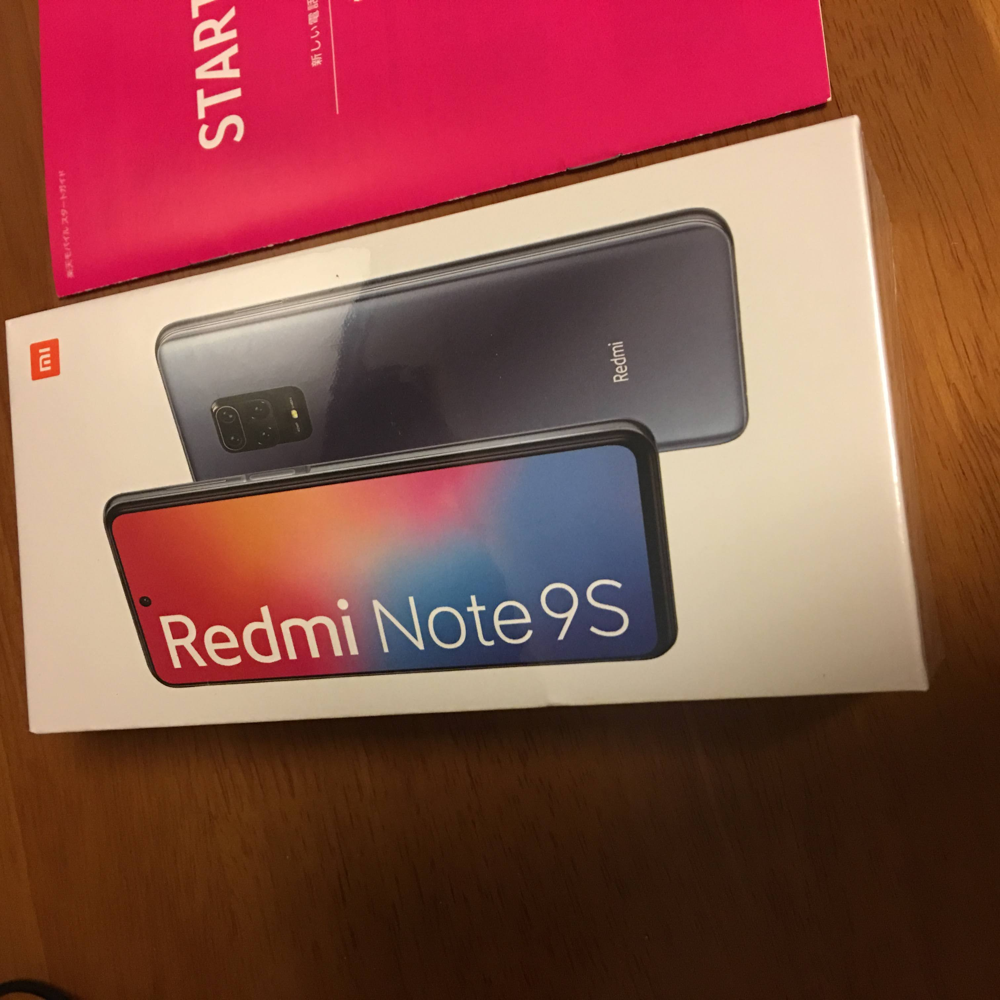
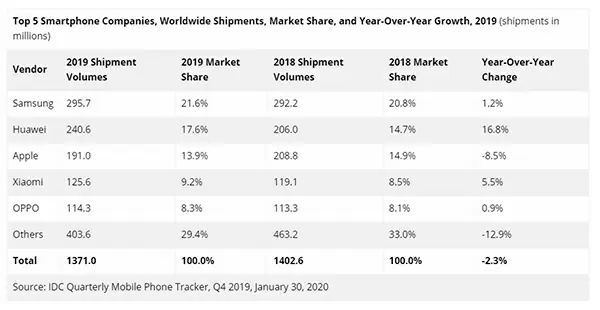
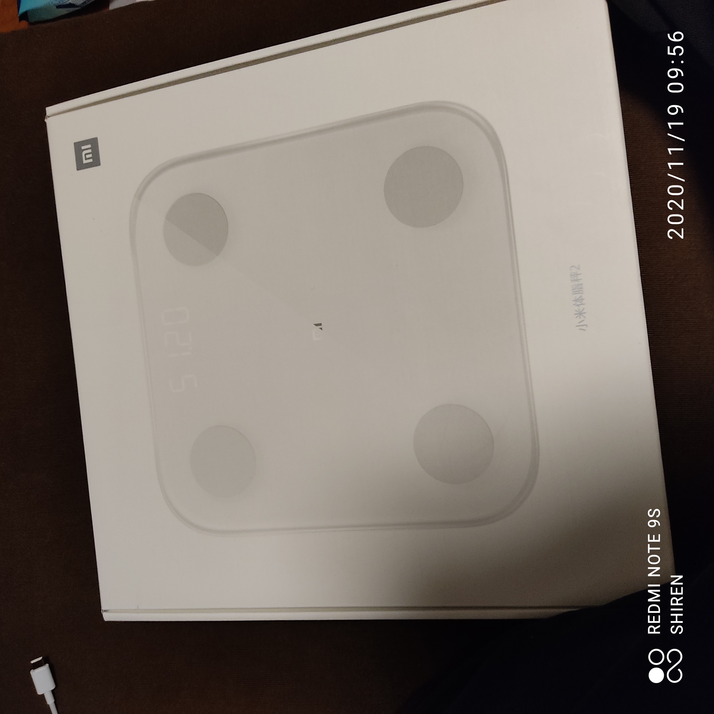
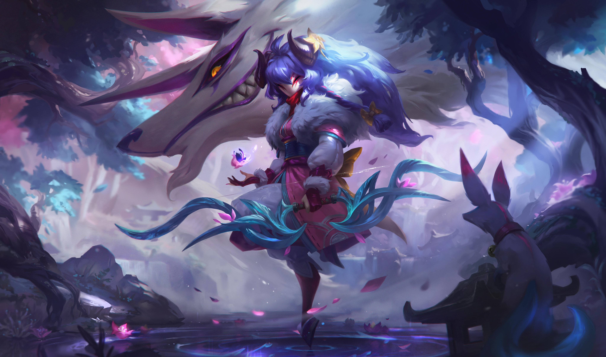
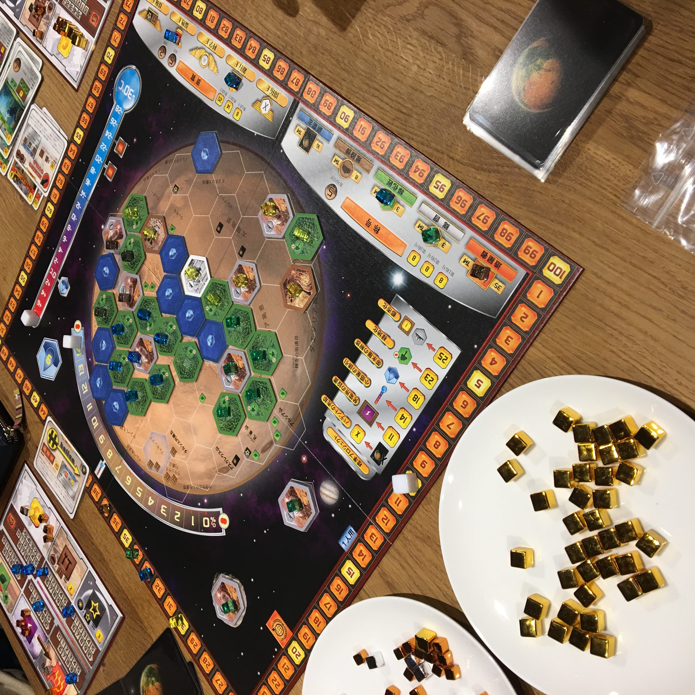

# 2020年 買ってよかったものランキングTOP50

僕は経済力に余裕があるので、50まで紹介したいと思います。

## 1. 楽天モバイル Rakuten UN-LIMIT V

「日本のスマホ代は た か す ぎ る  !!」と情弱煽り広告のモバイル回線。3大キャリアを選べば情弱煽りを受け、それ以外を選べば低所得煽りを受けることになる。この地獄をグルメやファッションと並べて、3大マウンティングと名付けてもいいだろう。

就活をするにあたって電話番号があったほうが便利なため契約。実際、このキャンペーンがなければ、モチベがなかったに違いない。行動意欲が煽られないかどうかの観点から、ツイートができるかどうか + 未経験を脱却できるかどうかの2点に変化したからだ。しかし本当に就活を経験したといえるのだろうか。よりハイレベルな企業を目指す過程で挫折を経験することを就活と呼ぶのならば、変わらず未経験である。つまり経験したつもりになって、無意識に経験詐称をしてしまっているのである。経験の話をするときには同時にレベルの情報が必要なのかもしれない。

 

## 2. Xiaomi Redmi Note 9S

中華ブランド"Xiaomi"  イニシャル"X"でカッコいいな。向こうでの名称は"小米" なんて可愛いのだろうか。このブランドの魅力は利益を最大5%しか取らないと宣言しているところだ。そんな神域のコストパフォーマンスでシェアを伸ばし、スマホの世界シェア4位にまで浮上した。そんなブランドの中でもローエンドモデルに当たる「Redmiシリーズ」の最新モデルを購入した。

 

## 3. Xiaomi Mi Band 5

上記と同じブランド製品だ。[これは以前にも紹介したことがある。](./2020-11-18.html)マイブームは新たな新生eSportsの睡眠スコアバトルだ。先週は自己ベスト更新の83を得点した。この記録に到達するために脱カフェインも実践している。健康煽りを回避するためにみんなも参戦しよう!!

 

## 4. Xiaomi Smart Scale 2

同ブランドだ。体重を測定したあとにカメラで撮影するのが面倒だったため購入。日常的に測定することで、健康を目指そうというわけだ。実際に2.5kgの増量に成功している。しかしXiaomiの情報によると筋肉量、BMI、体脂肪率の3点に注意が必要らしい。まだまだ健康への道程は長い、もはや到達は不可能にすら思える。

 

## 5. League of Legends Champion skins

「The Game Awards 2020」において、「Best Esports Game」を受賞したタイトルだ。これさえプレイしていればeSportsタイトル煽りを回避できる。そんなタイトルのゲーム内スキンを購入した。スキンの文化は購入するだけで簡単に満足感を得られる、購入理由を理解できてよかった。これからは積極的に購入していきたいと思う。

 

## 6. ボードゲーム テラフォーミング・マーズ

毎年ドイツで開催される「ドイツゲーム大賞」において、2017年に大賞を受賞した作品。それがようやく再販されたので購入(ボードゲーム業界の日本市場においては、人気タイトルは品切れが続くため)。重量級(高難易度、プレイ時間が長いなど)の中では、優しい今作は重量級を遊んでみたい人におすすめ。またジャンルも拡大再生産という、持てるリソースを消費して、生産規模を拡張し、再生産をすることから、 競争でありながら自分の中で満足できるため、人気のあるものになっている。このタイトルは拡張セットも複数発売されているので、またプレイしたい。

[ルール解説動画](https://youtu.be/ukSHAEKnFhA)
プレイ動画もあるので雰囲気がわかると思う。

 

## 7. ボードゲーム Miraris

Japanで販売されているほとんどが海外からの輸入タイトルと、同人作品である中、数少ない法人タイトルだ。パッケージを見ればひと目で分かる、オタク向けイラスト。これもこのブランドの特徴だ。

これは軽量級のバッティングゲーム。全員の手札は共通で1~9の数字カードで、これを毎ターン1枚だけ出す。他のプレイヤーと数字がバッティング(競合)しなければ得点し、それが多いプレイヤーの勝利となる。しかしこのタイトルはそれだけじゃあないんだあ。各プレイヤーにはキャラクターカードも配られ、それぞれ特殊能力があるため、それにあったプランを考えるのが面白い。ありそうでなかった丁寧な作品になっている。

[ルール説明動画](https://youtu.be/brLbx5wkrFY)

 

~~いかがでしたか?~~

 
